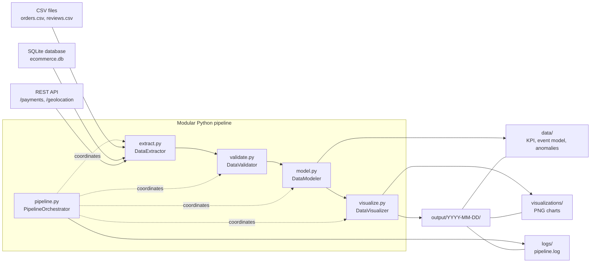
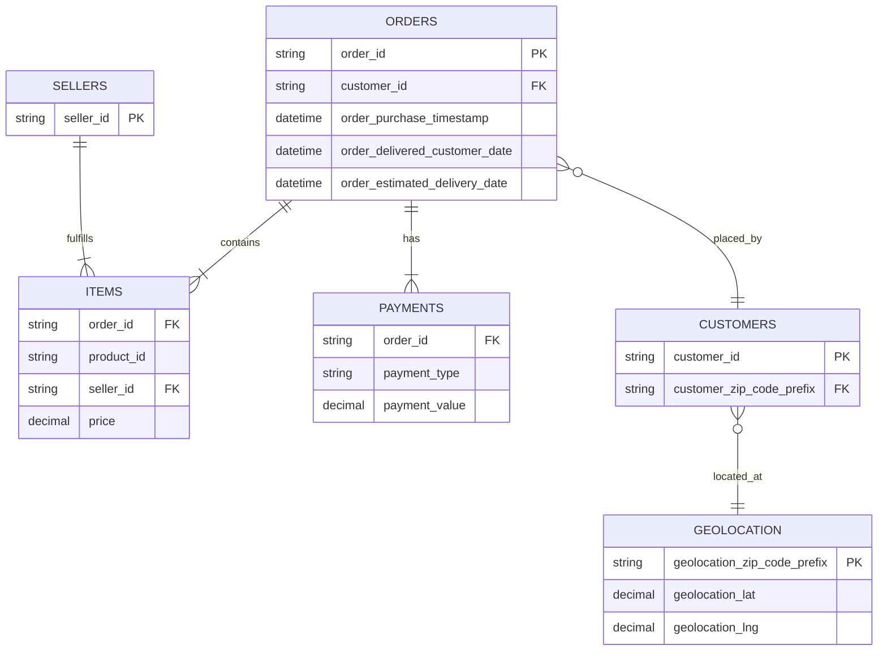

# Olist Delivery Reliability Pipeline

## Problem statement and stakeholders

Customer satisfaction is dropping because orders are arriving after the promised delivery date. This project gives Operations, Customer Experience, Seller Management, and Logistics stakeholders a dependable way to identify where late orders accumulate: approval, seller dispatch, or carrier transit.

The pipeline preserves the raw order population, validates chronological business rules, flags exceptions instead of silently dropping them, and produces date-partitioned evidence that can be reviewed by business and engineering teams.

## Project KPI

The primary KPI is **Percentage of orders delivered past the estimated delivery date**:

```text
late orders / analyzed orders * 100
```

An order is late when `order_delivered_customer_date` is later than `order_estimated_delivery_date`. For late orders, the pipeline also reports average elapsed days for:

| Fulfillment stage | Timestamp interval |
| --- | --- |
| Approval | Purchase to approval |
| Dispatch | Approval to carrier handoff |
| Transit | Carrier handoff to customer delivery |

## Source overview

`DataExtractor` combines three source types:

| Source | Current inputs | Role |
| --- | --- | --- |
| CSV | `data/raw/orders.csv`, `data/raw/reviews.csv` | Core order and review records |
| SQLite | `data/raw/ecommerce.db` | Items, customers, sellers, products, and category translation |
| REST API | `/payments`, `/geolocation` at `OLIST_API_URL` | Payment and location records with pagination and retry handling |

The default API endpoint is `http://localhost:8000`. When the API source is not hosted elsewhere, start the included local fixture in a separate terminal with `uvicorn data.api.main:app --reload --port 8000`.

## Setup and usage

```bash
git clone <repository-url>
cd olist-fde-pipeline
python -m venv .venv
source .venv/bin/activate
pip install -r requirements.txt
```

Run a partitioned pipeline job (this automatically starts the Streamlit dashboard at `http://localhost:8501`, preselected to the new run):

```bash
python -m src.pipeline --run-date "$(date +%F)"
```

To launch or reopen the evidence dashboard independently:

```bash
streamlit run src/dashboard.py
```

Optional environment variables include `OLIST_DATA_DIR`, `OLIST_OUTPUT_DIR`, `OLIST_API_URL`, `OLIST_API_TIMEOUT`, `OLIST_API_MAX_RETRIES`, and `OLIST_API_RETRY_BACKOFF`.

Generated artifacts are written to `output/YYYY-MM-DD/`:

```text
logs/pipeline.log
data/kpi_dashboard.csv
data/clean_event_model.csv
data/flagged_anomalies.csv  (only when exceptions exist)
visualizations/*.png
```

## Architecture

### Source map



The editable source for this diagram is [`docs/source-map.mmd`](docs/source-map.mmd).

### Data model



The editable source for this diagram is [`docs/data-model.mmd`](docs/data-model.mmd).

## EDA notebook

`eda.ipynb` contains reproducible checks for missing values in orders and payments, plus an inner join of orders and items followed by an item-price distribution analysis:

```bash
jupyter notebook eda.ipynb
```

## Data quality and scope matrix

| Classification | Statement |
| --- | --- |
| **Known** | The source provides purchase, approval, carrier-handoff, customer-delivery, and estimated-delivery timestamps. The validator explicitly checks chronological contradictions and missing delivery dates for delivered orders. |
| **Assumption** | Source timestamps are interpreted in one consistent timezone/clock standard. The pipeline currently parses them as timezone-naive datetimes and does not apply a geographic timezone conversion. |
| **Unknown** | External carrier conditions such as weather, traffic, labor disruption, vehicle capacity, and route-level exceptions are not present in the supplied data and cannot be attributed by this pipeline. |
| **Limitation** | This is a batch pipeline over CSV, SQLite, and paginated REST inputs. It does not provide real-time streaming, event-time watermarks, continuous incremental processing, or automated alerting. |

## Testing

```bash
pytest -q
```
