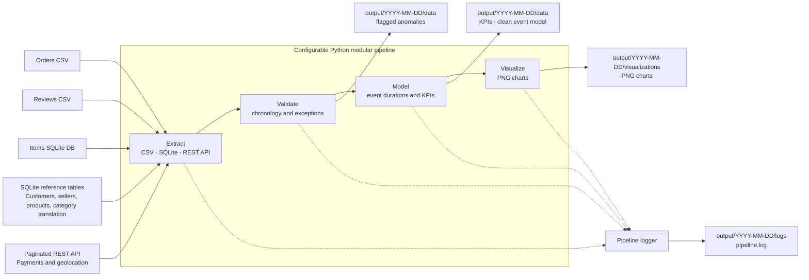
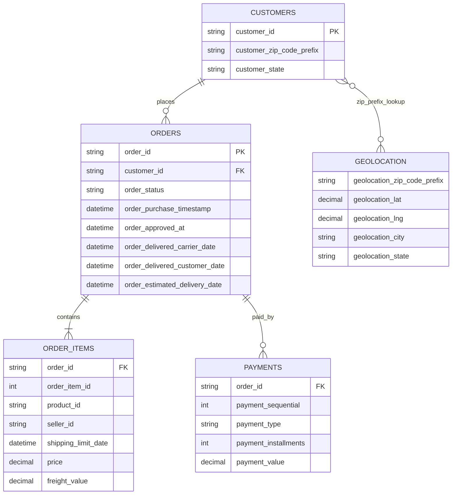

# Olist E-commerce Delivery Reliability Pipeline

A configurable, batch-oriented data pipeline for measuring late deliveries and identifying whether fulfillment delays are concentrated in approval, seller dispatch, or carrier transit.

## Business problem and stakeholders

Customer satisfaction is dropping because orders are arriving later than the estimated delivery date. **Logistics Managers** and **Operations Leads** need a dependable, repeatable view of delivery performance so they can direct operational attention to the right part of the fulfillment journey.

The pipeline ingests operational data from CSV, SQLite, and a paginated REST API; validates key order chronology rules; models fulfillment-stage durations; and emits run-date-partitioned KPI, data-quality, and visualization artifacts.

## Project KPI and decision support

The primary KPI is the **percentage of valid, comparable delivered orders that arrived after the estimated delivery date**:

```text
late-delivery percentage = late valid delivered orders / comparable valid delivered orders * 100
```

An order is late if `order_delivered_customer_date` is later than `order_estimated_delivery_date`. Delivered orders with missing required timestamps, malformed timestamps, or impossible lifecycle chronology are excluded from the KPI and included in `flagged_anomalies.csv`; the KPI artifact separately reports the number of delivered records excluded. Non-delivered orders with legitimately missing future timestamps are not classified as anomalies for those missing values. For late orders, the pipeline also reports average elapsed time in each stage:

| Fulfillment stage | Start → end timestamps |
| --- | --- |
| Approval | Purchase → approval |
| Dispatch | Approval → carrier handoff |
| Transit | Carrier handoff → customer delivery |

These measures support the operational decision to **intervene with specific slow sellers** when delays build before carrier handoff, versus **investigating or renegotiating carrier contracts** when post-handoff transit is the dominant bottleneck. Current sources do not identify individual carriers, so transit metrics are a signal for carrier follow-up—not proof of carrier-level attribution.

## Data sources

| Retrieval mode | Inputs and entities |
| --- | --- |
| **CSV** | `orders.csv` supplies order status and lifecycle timestamps; `reviews.csv` supplies customer review records. Paths are set under `sources.csv` in `config.yaml`. |
| **SQLite** | `ecommerce.db` supplies order items, customers, sellers, products, and product-category translation through configurable SQL queries. |
| **Paginated REST API** | `/payments` supplies payment records and `/geolocation` supplies postal-prefix coordinates and region metadata. Base URL, endpoint paths, page size, query parameter names, response keys, timeout, retry count, and retry backoff are configurable. |

The repository includes a local API fixture at `data/api/main.py`. Start it in a separate terminal when no compatible API service is available:

```bash
source .venv/bin/activate
uvicorn data.api.main:app --host 127.0.0.1 --port 8000
```

The fixture's data is local test/demo data; configure `api.url` or `OLIST_API_URL` to use a different API implementation.

## Configuration

Create a local YAML configuration from the complete template:

```bash
cp config.yaml.example config.yaml
```

`config.yaml` is loaded from the repository root by default and is excluded from Git so machine-specific paths and settings are not committed. Relative `paths.raw_data` and `paths.output_dir` values resolve from the repository root. CSV filenames and `paths.sqlite_file` resolve from `paths.raw_data`; output subdirectory names resolve within each `output_dir/YYYY-MM-DD` partition. Absolute paths are also accepted for the raw data root, output root, and SQLite file. To load configuration from another location, set `OLIST_CONFIG_FILE`. Unknown YAML keys are rejected with their dotted configuration path so typos do not silently fall back to defaults.

Optional environment overrides can be created from the supplementary template:

```bash
cp .env.example .env
```

The run scripts automatically source `.env` when it exists. Uncomment and adjust only the overrides required; environment values take precedence over YAML. No API credentials are needed for the included local fixture. The configuration precedence is:

```text
built-in defaults < config.yaml < exported OLIST_* variables < explicit Python constructor arguments
```

The YAML template exposes API behavior, input and output paths, CSV and SQLite source definitions, SQL, model timestamp fields, generated artifact names, visualization styling, and dashboard title/theme/port/layout. API responses must include a positive integer `total_pages`; `total_records` is optional, but when supplied it is checked against the number of records extracted.

## Setup and run

Exact direct dependency versions, verified in the project virtual environment, are listed in `requirements.txt`. Requirements are installed into the root `.venv` automatically by either run script. To prepare the environment manually:

```bash
python3 -m venv .venv
source .venv/bin/activate
python -m pip install --upgrade pip
python -m pip install -r requirements.txt
cp config.yaml.example config.yaml
```

Run a pipeline for a specific date, or omit the date to use the machine's current date:

```bash
./run_pipeline.sh 2026-09-27
./run_pipeline.sh
```

`run_pipeline.sh` installs dependencies, applies `.env` overrides, and executes `python -m src.pipeline --run-date <DATE>`. When the pipeline successfully writes its artifacts, it hands its process over to Streamlit, sets the selected run date, and serves the dashboard on the configured port (default `http://localhost:8501`). Use `Ctrl+C` in that terminal to stop the dashboard server.

Run the full automated test suite with:

```bash
./run_tests.sh
```

## Output artifacts

Each successful run writes to `<paths.output_dir>/<YYYY-MM-DD>/`:

```text
logs/pipeline.log
data/kpi_dashboard.csv
data/clean_event_model.csv
data/flagged_anomalies.csv       # written when anomalies exist
visualizations/*.png
```

Directory and artifact names are configurable. Each successful rerun of an existing date partition removes stale optional anomaly/chart files when the current run no longer produces them. The Streamlit dashboard reads the configured output directory and displays KPI metrics, charts, the clean event model, and any flagged exceptions.

## Architecture

### Source map and pipeline workflow



Editable Mermaid source: [`docs/source-map.mmd`](docs/source-map.mmd).

### Workflow and entity relationships



`GEOLOCATION` is associated to customer delivery regions through postal-code-prefix matching; it is a location lookup, not a direct foreign-key relationship stored on `ORDERS`.
Editable Mermaid source: [`docs/data-model.mmd`](docs/data-model.mmd).

## Known / Unknown / Assumption / Limitation (KUAL)

| Category | Statement |
| --- | --- |
| **Known** | The source provides purchase, approval, dispatch (carrier handoff), and customer-delivery timestamps, along with an estimated delivery date. Malformed timestamps and impossible lifecycle ordering are flagged; delivered records missing required timestamps are retained as anomalies rather than silently included in KPI calculations. |
| **Unknown** | Weather events, carrier-specific route breakdowns, and manual data-entry errors at the warehouse are not represented well enough in the supplied data to identify or attribute their effect. |
| **Assumption** | All timestamps are assumed to be expressed in the same timezone (BRT). Missing required timestamps for records with `delivered` status are treated as data-quality anomalies, not as pending deliveries; missing future timestamps for non-delivered orders are permitted. The pipeline currently does not convert timestamps between timezones. |
| **Limitation** | The pipeline operates in batch mode, not real-time streaming. API extraction decodes each paginated JSON response into memory and accumulates the retrieved records in memory for DataFrame construction; memory use therefore grows with the source volume. The API must provide `total_pages` metadata, and no carrier-specific route or weather data is available for root-cause attribution. |
