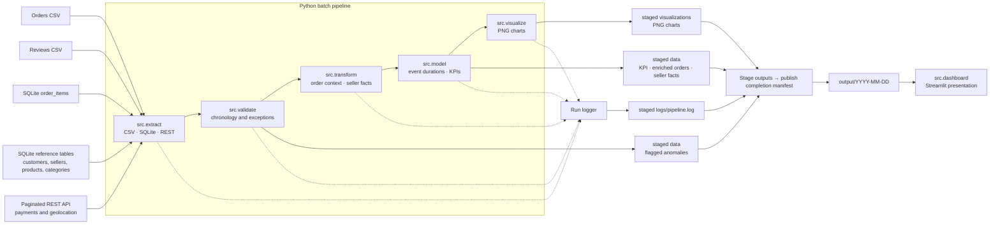
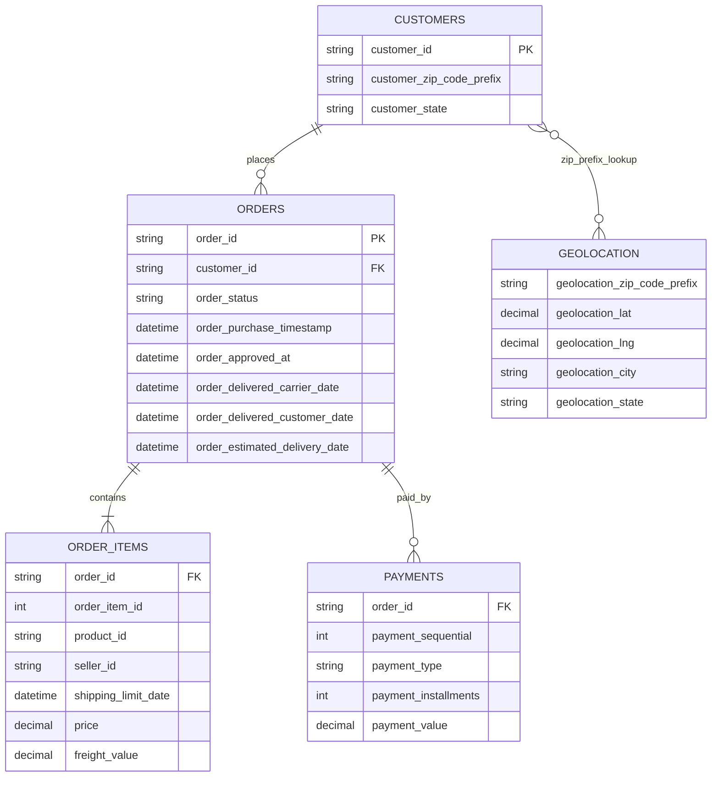

# Olist Delivery Reliability Pipeline

A configurable batch pipeline for examining Olist e-commerce order fulfillment, measuring late deliveries, surfacing lifecycle data-quality exceptions, enriching orders with item/payment/customer/geographic context, and presenting seller accountability evidence to operations stakeholders.

## Business objective

Customer satisfaction is under pressure when orders arrive later than the date promised to the customer. Logistics Managers and Operations Leads need to distinguish delays associated with order approval, seller dispatch, and post-handoff transit so they can decide where to intervene.

This project ingests order lifecycle data alongside order items, payments, seller/customer reference tables, and geographic lookups. It validates timestamp quality and event chronology, creates an order-grain context model and separate order-seller accountability facts, calculates delivery KPIs, stages run artifacts, and publishes completed date partitions for the Streamlit dashboard.

**Decision supported:** compare purchase-to-approval, seller dispatch, and carrier-transit elapsed times to identify where delays concentrate; use the seller fact to find high-volume sellers with elevated dispatch time or late rates. The supplied data has no payment-authorization timestamp or carrier identity, so it cannot measure payment approval latency or assign transit delays to a particular carrier.

## KPI definitions

The headline measure is the percentage of valid, comparable delivered orders delivered after the estimated delivery date:

```text
late-delivery percentage =
    late valid delivered orders / valid delivered orders with actual and estimated dates * 100
```

An order is late when its actual customer delivery timestamp is strictly later than its estimated delivery timestamp. Equality is on time. `Total Orders Analyzed` is the denominator used for this percentage; `Delivered Orders Excluded from KPI` reports delivered records excluded because validation rejected them or they could not be compared.

For both all valid comparable delivered orders and the late comparable subset, the KPI artifact reports average stage durations:

| Stage | Duration |
| --- | --- |
| Order approval | Purchase → approved (not payment authorization) |
| Dispatch | Approval → carrier handoff |
| Transit | Carrier handoff → customer delivery |

Durations are expressed in fractional days. Stage averages are descriptive, not causal attribution. Seller accountability is computed from seller-order membership; multi-seller orders contribute to every participating seller and are not an exclusive allocation of fault.

## System architecture

The pipeline runs in-process in the order Extract → Validate → Model → Visualize → Persist. Once artifacts have been written successfully, `src.pipeline` replaces the process arguments with Streamlit CLI arguments and hands the process to the configured dashboard script.



Editable sources: [`docs/source-map.mmd`](docs/source-map.mmd) and [`docs/data-model.mmd`](docs/data-model.mmd).

### Entity and relationship view



Geolocation is a postal-prefix lookup rather than a direct foreign key on orders. The relationship shown represents a join opportunity through customer postal-code prefixes; matching quality and aggregation policy need to be considered when using that lookup.

## Source data and extraction

| Source mode | Default input | Data retrieved |
| --- | --- | --- |
| CSV | `data/raw/orders.csv` | Order status and purchase, approval, dispatch, actual-delivery, and estimated-delivery timestamps. |
| CSV | `data/raw/reviews.csv` | Customer review records. |
| SQLite | `data/raw/ecommerce.db` | `order_items`, `customers`, `sellers`, `products`, and `category_translation`; SQL is configurable. |
| Paginated REST API | `http://localhost:8000/payments` | Payment records by order. |
| Paginated REST API | `http://localhost:8000/geolocation` | Postal-prefix coordinates, city, and state. |

Items and payments are aggregated to one row per order before they are joined with Orders, so one-to-many source relationships do not inflate the order-grain KPI denominator. Customers join by `customer_id`; geolocation joins through normalized postal-code prefixes and repeated geolocation points are averaged by prefix. Seller accountability is stored separately at order/seller grain. Reviews, products, and category translations are extracted for downstream use but are not currently joined into the operational order context.

The local API fixture is implemented in `data/api/main.py`; it reads `payments.json` and `geolocation.json` from its own directory, independent of the shell's current working directory. The pipeline does not start it automatically. Start the configured API separately before running the pipeline:

```bash
source .venv/bin/activate
uvicorn data.api.main:app --host 127.0.0.1 --port 8000
```

The extractor requires every response to be a JSON object containing a list under the configured data key and a positive integer `total_pages`. `total_records` is optional; if supplied on any page, the final extracted record count must match it. API records must be JSON objects. Requests use the configured timeout and retry behavior; failed HTTP requests, malformed responses, invalid metadata, and record-count mismatches raise extraction errors rather than returning a partial dataset.

## Configuration

Create a working configuration from the checked-in template:

```bash
cp config.yaml.example config.yaml
```

The application loads configuration sources in ascending precedence:

```text
built-in defaults < config.yaml < OLIST_* environment variables < explicit constructor arguments
```

`config.yaml` is optional, repository-root-relative by default, and excluded from version control. Unknown YAML keys, invalid section shapes, and scalar values of the wrong type fail during configuration loading instead of silently falling back to defaults.

Optional environment overrides can be prepared from `.env.example`:

```bash
cp .env.example .env
```

Both run scripts source `.env` before starting Python. Treat `.env` as executable shell input: only source a file you trust. Python processes launched directly do not automatically load `.env`; export the desired `OLIST_*` values yourself or use the provided scripts. No credentials are required for the local fixture.

### Path rules

| Setting | Relative path base |
| --- | --- |
| `paths.raw_data` | Repository root |
| `paths.output_dir` | Repository root |
| `sources.csv.orders`, `sources.csv.reviews` | `paths.raw_data` |
| `paths.sqlite_file` | `paths.raw_data` |
| `paths.output_logs_dir`, `paths.output_data_dir`, `paths.output_visualizations_dir` | `<paths.output_dir>/<run-date>` |

Absolute roots and an absolute SQLite filename are also supported. The source paths and output layout can be changed in `config.yaml` or with the matching documented `OLIST_*` overrides.

## Install, run, and test

The scripts require the exact Python version in `.python-version` (currently 3.14.7), create `.venv` when needed, activate it, upgrade pip to the pinned script version, and install direct requirements constrained by `constraints-py3.14-linux.txt`. The constraints file snapshots transitive versions for CPython 3.14 on Linux; other Python/platform combinations require a separately generated lock.

```bash
cp config.yaml.example config.yaml
./run_pipeline.sh 2026-09-27
```

When the date is omitted, `run_pipeline.sh` uses the machine's current date:

```bash
./run_pipeline.sh
```

The script validates the date as a real GNU/Linux calendar date before dependency installation. The pipeline checks that the configured payments API endpoint responds before extraction; it fails with setup guidance when the service is unavailable. It runs `python -m src.pipeline --run-date <DATE>`. After staged artifact publication succeeds, the pipeline sets the selected run date for the dashboard, disables Streamlit usage-stat collection, and takes over the process to serve the dashboard at `http://localhost:8501` by default (port is configurable). Stop it with `Ctrl+C`.

Run automated tests in the same managed environment:

```bash
./run_tests.sh
```

The repository also contains a manual local API smoke check. Start the fixture server in one terminal and run the check from another:

```bash
python test_api.py
```

## Dashboard and output layout

The dashboard at `src/dashboard.py` uses the configured output root and provides:

- An available-run selector, defaulting to the run date produced by the pipeline when that partition is available.
- An **Executive Summary** with comparable delivered order denominator, late deliveries, percentage late, comparison coverage and exclusions, charts, and late-vs-all-comparable stage-duration averages.
- A **Full Data Explorer** backed by the enriched order context, with case-insensitive order-ID filtering.
- A **Seller Accountability** view with order volume, dispatch averages, comparable delivered denominator, and late rate; low-volume sellers are not ranked in the primary view.
- **Quality Exceptions** showing flagged rows when the run has anomalies.

Each run writes to `<paths.output_dir>/<YYYY-MM-DD>/`:

```text
logs/
  pipeline.log
data/
  kpi_dashboard.csv
  clean_event_model.csv          # order-grain lifecycle plus aggregated context
  seller_accountability.csv      # one seller/order contribution summarized by seller
  flagged_anomalies.csv       # only when anomalies exist
visualizations/
  transit_times_distribution.png
  late_order_bottlenecks.png  # only when late orders exist
```

Artifacts are first written to a hidden staging directory. After all output writes succeed, the pipeline writes `_SUCCESS.json` and promotes the completed run partition; the dashboard lists only partitions with a valid completion manifest. A failed run is retained as a hidden attempt with `_RUN_STATUS.json` and any anomalies discovered, leaving the prior published partition unchanged. Optional anomaly and chart outputs are absent when not produced by a successful run.

## Data-quality rules and KPI interpretation

`DataValidator` requires configured lifecycle timestamp columns and an `order_status` column. It parses timestamps with coercion, flags non-empty malformed values, flags missing lifecycle timestamps for delivered statuses, and flags any reversed pair among purchase, approval, dispatch, and delivery timestamps. Non-delivered rows may have missing future timestamps; those missing values alone are not anomalies.

Anomalous order rows are retained in `flagged_anomalies.csv`, not included in the clean event model. A delivery can only be compared with the promise if both actual and estimated delivery dates exist. `DataModeler.generate_kpi_dashboard` counts delivered, valid, comparable orders in the denominator; the pipeline adds delivered anomalies to the exclusion count and reports coverage over delivered orders. If there are no comparable orders, percentage late is reported as `0` with total analyzed equal to `0`; inspect coverage and exceptions before interpreting this as a healthy outcome.

## Known, unknown, assumptions, and limitations

| Category | Statement |
| --- | --- |
| **Known** | Source lifecycle fields represent purchase, order approval, carrier handoff, customer delivery, and estimated customer delivery. The pipeline validates timestamp parseability and chronology and retains anomaly details. It can aggregate item revenue/freight and payment values but has no payment authorization event. |
| **Unknown** | Weather, carrier-specific route/identity breakdowns, payment authorization times, and manual warehouse data-entry causes are unavailable for root-cause attribution. |
| **Assumption** | All timestamps are treated as one timezone (BRT); parsing does not convert zones. Delivered rows missing required lifecycle timestamps are anomalies; missing future stages on non-delivered rows are allowed. Geolocation points are averaged by normalized postal prefix. |
| **Limitation** | Processing is batch-oriented, not streaming. Paginated API pages and accumulated records are held in memory. Seller metrics represent seller participation; multi-seller orders contribute to each seller and do not prove sole responsibility. |
| **Limitation** | No carrier identity is supplied, so transit durations are not carrier-specific evidence. The local API fixture is for development, not production. The transitive dependency constraints are targeted to Linux/CPython 3.14. |

## Documentation and specifications

- [Function specifications](docs/specs/functions/README.md) — class/function contracts, inputs, outputs, errors, and side effects.
- [Technical architecture specification](docs/specs/technical/architecture.md) — components, runtime lifecycle, deployment boundary, and failure behavior.
- [Data contracts and KPI specification](docs/specs/technical/data-contracts.md) — input/output schemas, validation, and metric definitions.
- [Configuration and operations specification](docs/specs/technical/configuration-and-operations.md) — precedence, path semantics, run scripts, dashboard handoff, and support procedures.
- [Transformation specification](docs/specs/functions/transformation.md) — order-grain context and seller-order aggregation.

## Repository map

```text
src/
  config.py       YAML/environment configuration and validation
  extract.py      CSV, SQLite, and REST extraction
  validate.py    lifecycle chronology and anomaly classification
  model.py        event-model durations and KPI aggregation
  transform.py    order context and seller accountability aggregation
  visualize.py    run-scoped PNG chart generation
  logger.py       file and terminal logging
  pipeline.py     orchestration, persistence, and Streamlit handoff
  dashboard.py    interactive Streamlit presentation
data/api/
  main.py         local paginated FastAPI fixture
docs/
  specs/          function and technical specifications
  *.mmd           editable Mermaid architecture diagrams
tests/            offline regression suite
```
